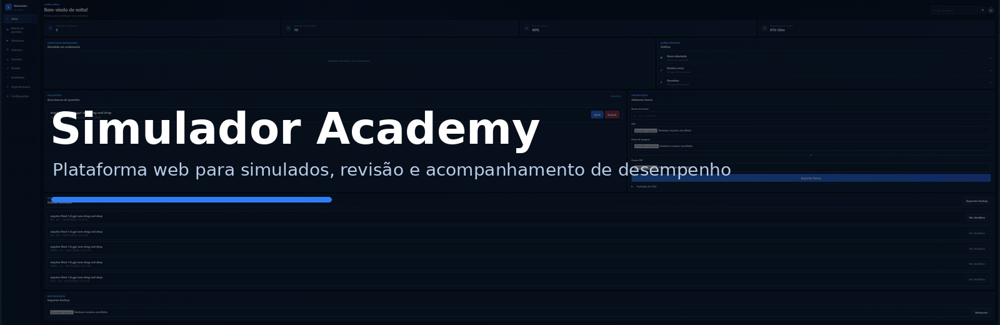

<p align="center">
  
</p>

<p align="center">
  <strong>Plataforma completa para simulados, revisão inteligente e acompanhamento de desempenho.</strong>
</p>

<p align="center">
  
  
  
  
  
</p>

---

## ✨ Visão geral

O **Simulador Academy** é uma aplicação web para preparação de certificações e avaliações técnicas.  
Ela combina execução de simulados, revisão de erros, análise de desempenho, sincronização em nuvem e funcionamento offline.

### Principais recursos

- 🔐 Login por e-mail e senha com Supabase
- ☁️ Sincronização do progresso em nuvem
- 💾 Cache offline com IndexedDB
- 📦 Importação por CSV, pasta de imagens ou ZIP
- ▶️ Continuação automática do simulado
- ⭐ Favoritos, marcações e anotações
- 🧠 Revisão inteligente por erros, acertos e categorias
- 📈 Curva de aprendizado e dashboard analítico
- 🗂️ Histórico detalhado
- 🃏 Flashcards automáticos a partir das questões erradas
- 🎯 Meta diária, XP, níveis e conquistas
- 🔥 Sequência de estudos
- 🔎 Busca global e filtros avançados
- 📱 Aplicação instalável como PWA

---

## 🖥️ Telas do sistema

### 🔐 Login

<p align="center">
  
</p>

### 🏠 Início, bancos e importação

<p align="center">
  
</p>

### 📝 Simulado

<p align="center">
  
</p>

### ✅ Resultado

<p align="center">
  
</p>

### 📜 Histórico

<p align="center">
  
</p>

### 🧠 Revisão inteligente

<p align="center">
  
</p>

### 📊 Estatísticas e curva de aprendizado

<p align="center">
  
</p>

### 🧭 Guia de utilização

<p align="center">
  
</p>

---

## 🆕 Recursos da V6

### 🃏 Flashcards

As questões erradas são convertidas automaticamente em cartões de revisão.  
É possível filtrar por categoria, embaralhar os cartões e revelar a resposta sob demanda.

### 🎯 Perfil e metas

- Meta diária configurável
- XP e níveis
- Sequência de estudos
- Calendário de atividade
- Conquistas desbloqueáveis
- Recomendações baseadas nas categorias com menor taxa de acerto

### 🔎 Busca global

Pesquisa em:

- enunciados;
- alternativas;
- feedbacks;
- categorias;
- respostas corretas.

Filtros disponíveis:

- erros;
- favoritas;
- questões com imagens.

### 📱 PWA

A aplicação pode ser instalada no computador ou celular e continua funcionando offline com os dados locais disponíveis.

---

## 🏗️ Arquitetura

<p align="center">
  
</p>

O progresso é salvo primeiro no **IndexedDB**. Quando há conexão e o usuário está autenticado, os dados são sincronizados com o **Supabase**.

Na versão **V6.0.2**, o mesmo banco passa a ser reconhecido pelo conteúdo das questões, mesmo quando é importado novamente em outro computador. Registros criados pelas versões anteriores são identificados e migrados automaticamente, preservando as respostas já sincronizadas.

Esta versão também corrige a falha do botão **Salvar e sair** causada pelas variáveis de fila de sincronização não declaradas.

Na **V6.1.1**, a conta sincroniza bancos, questões, simulados em andamento e todos os resultados do histórico. As imagens permanecem no cache local para evitar o limite de tamanho e o timeout `57014` do Supabase; o restante da conta é restaurado em outro computador ou em navegação anônima.

Na **V6.2.0**, as imagens passam a usar um bucket privado do Supabase Storage, sem ocupar os registros JSON do progresso. A página Configurações inclui um diagnóstico completo da sincronização. Execute `SUPABASE_STORAGE_SETUP.sql` uma vez antes de sincronizar imagens.

Na **V6.2.1**, uma restauração sem imagens não apaga mais os arquivos locais. O mesmo CSV pode ser reimportado com sua pasta de imagens para completar o banco, preservando integralmente o progresso e o histórico.

---

## 🛠️ Tecnologias

| Tecnologia | Uso |
|---|---|
| HTML5 | Estrutura da aplicação |
| CSS3 | Interface, responsividade e dashboard |
| JavaScript ES Modules | Regras de negócio e componentes |
| IndexedDB | Persistência local e funcionamento offline |
| Supabase Auth | Login por e-mail e senha |
| Supabase PostgreSQL | Progresso, histórico e metadados |
| Service Worker | Cache e PWA |
| Papa Parse | Leitura de CSV |
| JSZip | Importação de pacotes ZIP |
| GitHub Pages | Hospedagem estática |

---

## 📁 Estrutura

```text
/
├── index.html
├── app.js
├── cloud.js
├── db.js
├── style.css
├── service-worker.js
├── manifest.webmanifest
├── README.md
└── docs/
    ├── banner.png
    ├── arquitetura.png
    └── screens/
```

---

## 🚀 Publicação no GitHub Pages

1. Envie todos os arquivos para a raiz do repositório.
2. Abra **Settings → Pages**.
3. Selecione a branch principal e a pasta raiz.
4. Aguarde a publicação.
5. Atualize o navegador com `Ctrl + Shift + R`.

---

## 📦 Formato do CSV

```csv
id;categoria;tipo;pergunta;imagem_pergunta;alt_a;img_a;alt_b;img_b;alt_c;img_c;alt_d;img_d;alt_e;img_e;correta;feedback
```

Tipos aceitos:

- `single`
- `multiple`
- `dragdrop`

---

## 🔐 Segurança

A aplicação usa apenas a **Publishable Key** do Supabase no frontend.  
Nunca coloque no repositório:

- senha do banco;
- Service Role Key;
- JWT Secret;
- Secret Key.

As tabelas devem permanecer protegidas por **Row Level Security (RLS)**.

---

## 🗺️ Roadmap

- [x] Simulados e importação CSV
- [x] Imagens em perguntas e alternativas
- [x] Revisão detalhada
- [x] IndexedDB e funcionamento offline
- [x] Supabase Auth e Cloud Sync
- [x] Dashboard e curva de aprendizado
- [x] Flashcards
- [x] Metas, XP, níveis e conquistas
- [x] Busca global
- [x] PWA instalável
- [ ] Repetição espaçada avançada
- [ ] Compartilhamento de bancos
- [ ] Dashboard de instrutor
- [ ] Aplicativo nativo

---

## 👨‍💻 Autor

Desenvolvido por **Jadson Rodrigues**.

---

<p align="center">
  <strong>Simulador Academy — estude com dados, revise com estratégia e evolua continuamente.</strong>
</p>
