<p align="center">
  
</p>

<h1 align="center">🎓 Simulador Academy</h1>

<p align="center">
  <strong>Plataforma web completa para simulados, revisão inteligente, memorização e acompanhamento de desempenho.</strong>
</p>

<p align="center">
  
  
  
  
  
  
</p>

<p align="center">
  <a href="#-visão-geral">Visão geral</a> •
  <a href="#-menus-e-telas">Telas</a> •
  <a href="#-formato-do-csv">CSV</a> •
  <a href="#-arquitetura-e-sincronização">Arquitetura</a> •
  <a href="#-instalação">Instalação</a>
</p>

---

## 🚀 Visão geral

O **Simulador Academy** foi desenvolvido para transformar bancos de questões em uma experiência de estudo moderna, organizada e acessível diretamente pelo navegador.

A aplicação funciona online e offline, aceita questões com texto e imagens, preserva o progresso automaticamente e sincroniza bancos, respostas, histórico e arquivos entre computadores usando a mesma conta.

### Recursos principais

- 🔐 Autenticação por e-mail e senha
- ☁️ Sincronização incremental entre computadores
- 🖼️ Imagens privadas no Supabase Storage
- 💾 Cópia offline no IndexedDB
- 📚 Importação por CSV, pasta de imagens ou ZIP
- ▶️ Continuação exata do simulado em andamento
- ✅ Questões de resposta única e múltipla
- ⭐ Favoritas, marcações e anotações
- 🧠 Revisão inteligente de erros e acertos
- 📊 Estatísticas, categorias e curva de aprendizado
- 🃏 Flashcards gerados a partir dos erros
- 🎯 Metas diárias, XP, níveis e conquistas
- 🔥 Sequência e calendário de estudos
- 🔍 Pesquisa global por questão, resposta ou categoria
- 📦 Backup e recuperação de versões anteriores
- 📱 PWA instalável no computador ou celular

---

## 🧭 Menus e telas

### 🏠 Início

A página inicial concentra o que é necessário para continuar estudando: simulado em andamento, banco de questões disponível e área de importação. O botão **Continuar** restaura questão atual, respostas, tempo, favoritas, marcações e anotações.

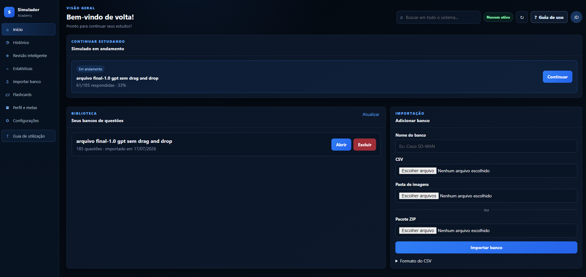

### 📚 Biblioteca e importação

Os bancos podem ser adicionados de três formas:

1. CSV;
2. CSV acompanhado de uma pasta de imagens;
3. pacote ZIP contendo o CSV e os arquivos visuais.

Ao reimportar o mesmo banco, as imagens são incorporadas sem apagar o progresso existente.

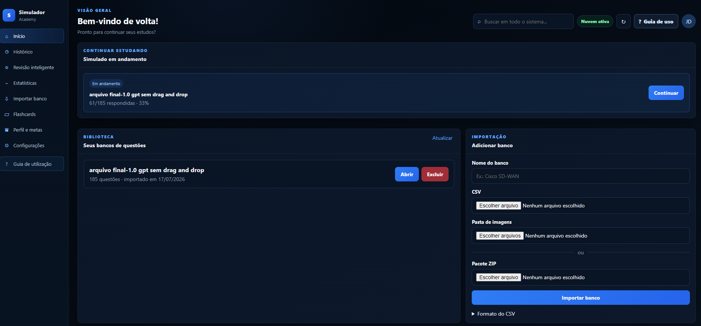

### 🕘 Histórico

Apresenta todos os simulados finalizados com aproveitamento, quantidade de acertos, total de questões e data. Em **Ver detalhes**, o usuário acessa respostas, correções, feedbacks e imagens preservadas.

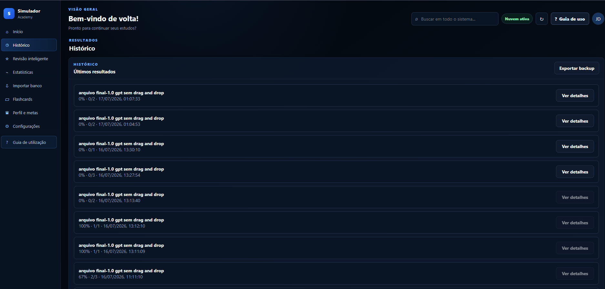

### 🧠 Revisão inteligente

Reúne questões erradas, corretas, favoritas, marcadas e anotadas. Os filtros permitem montar rapidamente uma sessão de revisão focada nos pontos de maior dificuldade.

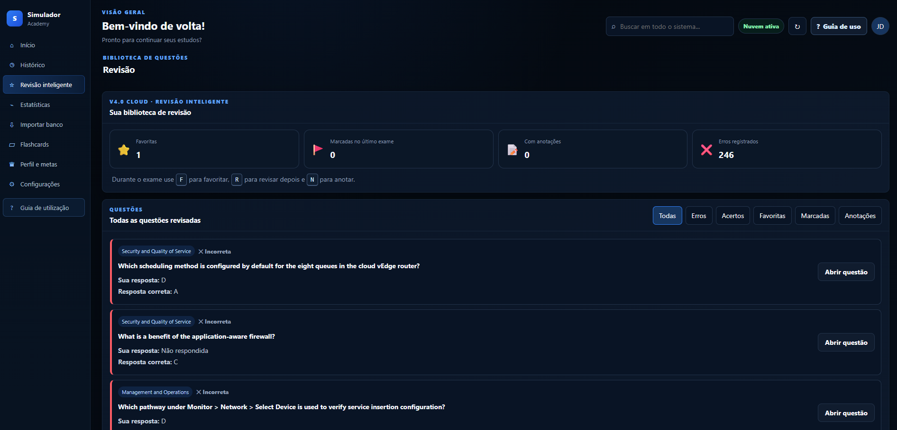

### 📊 Estatísticas

O painel analítico apresenta:

- simulados realizados;
- questões respondidas;
- taxa de acertos;
- tempo total de estudo;
- evolução do desempenho;
- acertos e erros;
- atividade por simulado;
- desempenho por categoria;
- tempo médio por questão.

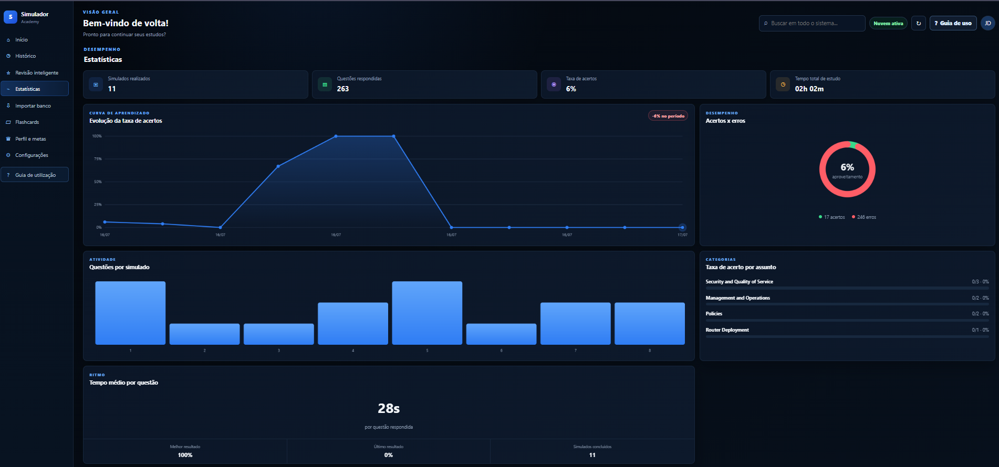

### 🃏 Flashcards

As questões erradas são convertidas em cartões de memorização. É possível filtrar por categoria, embaralhar, revelar a resposta e navegar entre os cartões.

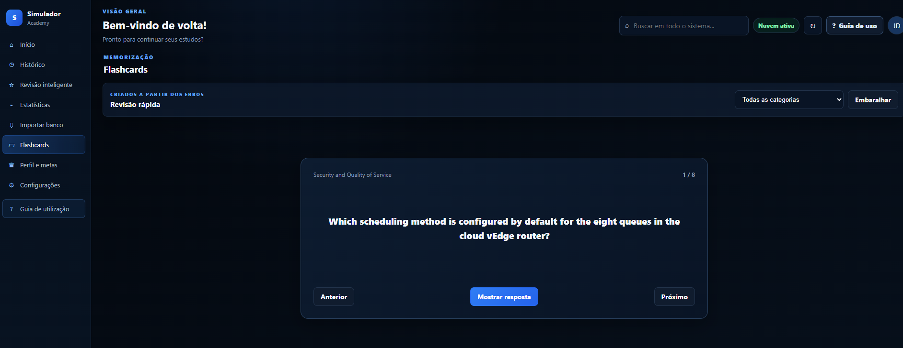

### 👤 Perfil e metas

O perfil exibe nível, XP, meta diária, progresso do dia e sequência de estudos. O calendário de atividade oferece uma visão compacta da regularidade do usuário.

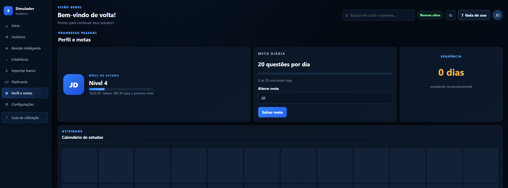

### 🏆 Conquistas e recomendações

Marcos são desbloqueados conforme o estudante avança. As recomendações identificam automaticamente categorias com menor aproveitamento e oferecem acesso direto à revisão.

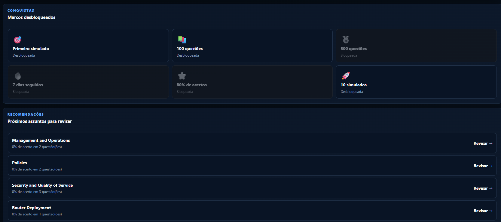

### ⚙️ Configurações e recuperação

A área de configurações localiza progressos existentes no navegador, permite continuar sessões antigas, restaurar backups e importar o formato legado do `localStorage`.

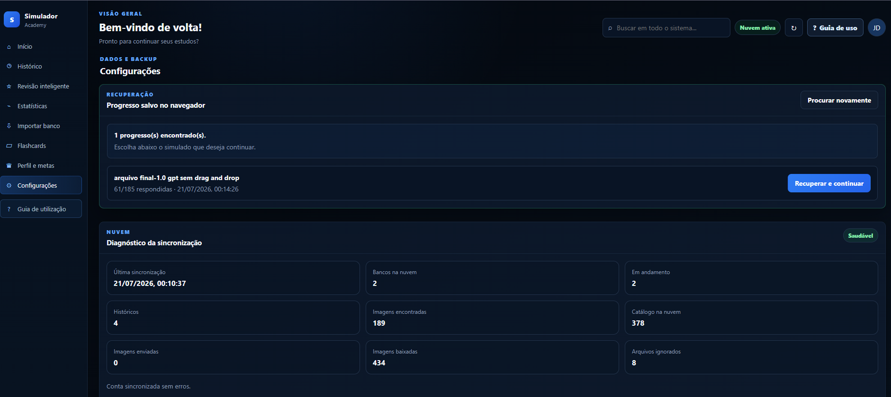

### ☁️ Diagnóstico da sincronização

O diagnóstico informa última sincronização, bancos, simulados em andamento, históricos, imagens locais, catálogo na nuvem, uploads, downloads e arquivos ignorados.

O catálogo visual é protegido por um `manifest.json` canônico no Storage, impedindo que um computador com dados parciais substitua o conjunto completo de imagens.

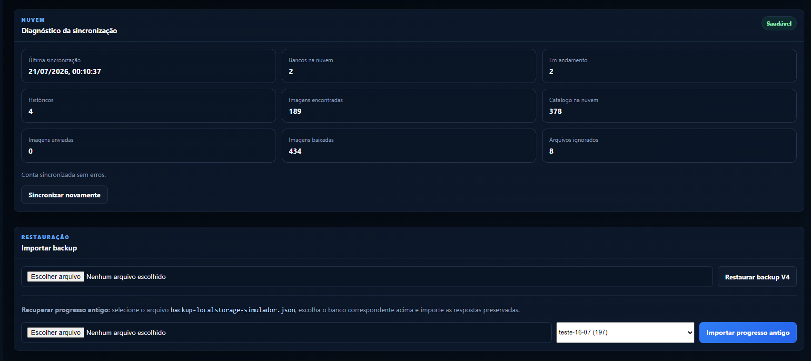

### 🧭 Guia interativo

Na primeira utilização, um tutorial em etapas apresenta as áreas essenciais da plataforma. Ele também pode ser reaberto pelo botão **Guia de uso**.

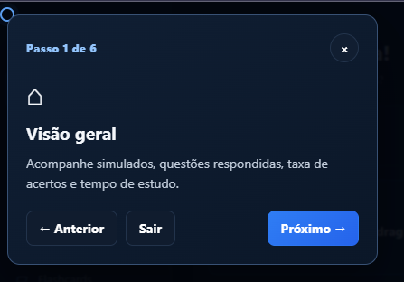

---

## 📝 Execução do simulado

Durante a prova, a interface entra em modo de foco e apresenta somente os elementos necessários:

- questão atual e total;
- quantidade respondida;
- cronômetro;
- barra de progresso;
- alternativas com texto ou imagem;
- anterior, próxima e mapa;
- favorita, revisar depois e anotações;
- salvar e sair.

O salvamento ocorre primeiro no IndexedDB e depois na nuvem. Se a conexão cair, a cópia local permanece disponível e a sincronização é retomada posteriormente.

---

## 📄 Formato do CSV

O arquivo utiliza `;` como separador e contém exatamente 17 colunas:

```csv
id;categoria;tipo;pergunta;imagem_pergunta;alt_a;img_a;alt_b;img_b;alt_c;img_c;alt_d;img_d;alt_e;img_e;correta;feedback
```

| Campo | Descrição |
|---|---|
| `id` | Identificador único da questão |
| `categoria` | Assunto ou domínio |
| `tipo` | `single`, `multiple` ou `dragdrop` |
| `pergunta` | Enunciado |
| `imagem_pergunta` | Arquivo visual do enunciado |
| `alt_a` a `alt_e` | Texto das alternativas |
| `img_a` a `img_e` | Imagens das alternativas |
| `correta` | Letra ou letras corretas |
| `feedback` | Explicação apresentada na revisão |

> Use codificação UTF-8 para preservar acentos e caracteres especiais.

---

## ☁️ Arquitetura e sincronização

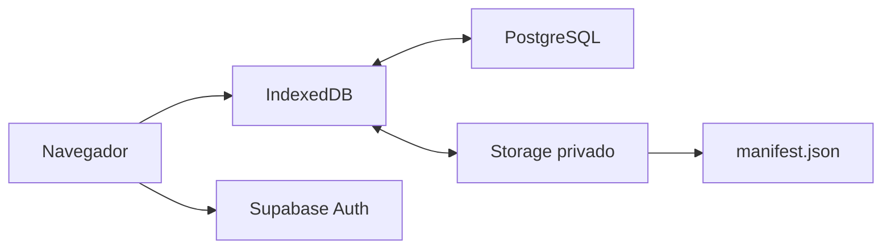

| Camada | Responsabilidade |
|---|---|
| IndexedDB | Bancos, progresso, histórico e imagens offline |
| Supabase Auth | Identidade e sessão do usuário |
| PostgreSQL | Metadados, respostas, progresso e histórico |
| Supabase Storage | Imagens privadas organizadas por usuário e banco |
| `manifest.json` | Relação canônica entre nomes do CSV e arquivos visuais |
| Service Worker | Cache dos arquivos principais e suporte PWA |

### Sincronização incremental

Ao atualizar a página, o sistema faz primeiro uma verificação leve. Uma sincronização completa acontece somente quando há alteração local, mudança em outro computador ou solicitação manual.

Imagens já existentes não são reenviadas. Arquivos ausentes são transferidos em paralelo e ficam armazenados no IndexedDB do novo dispositivo.

---

## 🛠️ Tecnologias

| Tecnologia | Utilização |
|---|---|
| HTML5 | Estrutura semântica |
| CSS3 | Interface, responsividade e animações discretas |
| JavaScript ES Modules | Regras de negócio |
| IndexedDB | Persistência offline |
| Supabase | Autenticação, PostgreSQL e Storage |
| Papa Parse | Leitura do CSV |
| JSZip | Importação de ZIP |
| Chart.js | Indicadores e gráficos |
| Service Worker | Cache e PWA |
| GitHub Pages | Hospedagem estática gratuita |

---

## 📁 Estrutura do projeto

```text
Simulador-3.0-main/
├── index.html
├── style.css
├── app.js
├── cloud.js
├── db.js
├── service-worker.js
├── manifest.webmanifest
├── modelo-questoes.csv
├── SUPABASE_STORAGE_SETUP.sql
├── SUPABASE_STORAGE_V6_4_MIGRATION.sql
├── README.md
└── docs/
    ├── banner.png
    └── screenshots/
```

---

## 🚀 Instalação

### GitHub Pages

1. Envie todos os arquivos para a raiz do repositório.
2. Abra **Settings → Pages**.
3. Selecione a branch principal e a pasta raiz.
4. Aguarde a publicação.
5. Abra a aplicação e pressione `Ctrl + Shift + R`.

### Supabase

1. Crie um projeto no Supabase.
2. Configure as tabelas e políticas RLS.
3. Execute `SUPABASE_STORAGE_SETUP.sql` no SQL Editor.
4. Em instalações anteriores à V6.4, execute também `SUPABASE_STORAGE_V6_4_MIGRATION.sql`.
5. Confirme o bucket privado `question-images`.

---

## 🔐 Segurança

- Cada usuário acessa somente seus próprios registros.
- As imagens permanecem em bucket privado.
- As políticas do Storage validam a pasta pelo `auth.uid()`.
- A aplicação utiliza apenas a chave pública do Supabase.
- Nunca publique `service_role`, JWT Secret ou credenciais administrativas.

---

## ✅ Status da V6.4.1

- [x] Progresso entre computadores
- [x] Histórico completo por usuário
- [x] Imagens sincronizadas pelo Storage
- [x] Manifesto canônico de imagens
- [x] Sincronização incremental
- [x] Importação CSV, pasta e ZIP
- [x] Revisão inteligente
- [x] Estatísticas e gráficos
- [x] Flashcards
- [x] Metas, XP e conquistas
- [x] Backup e recuperação
- [x] PWA e funcionamento offline

---

## 👨‍💻 Autor

Desenvolvido por **Jadson Rodrigues**.

<p align="center">
  <strong>Simulador Academy</strong><br>
  Estude com dados, revise com estratégia e evolua continuamente.
</p>
