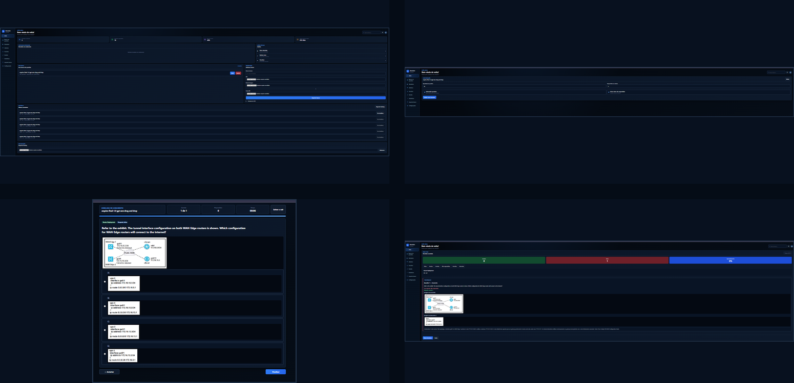
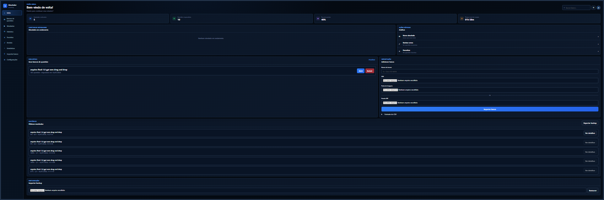
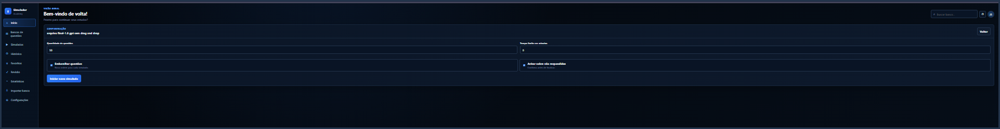
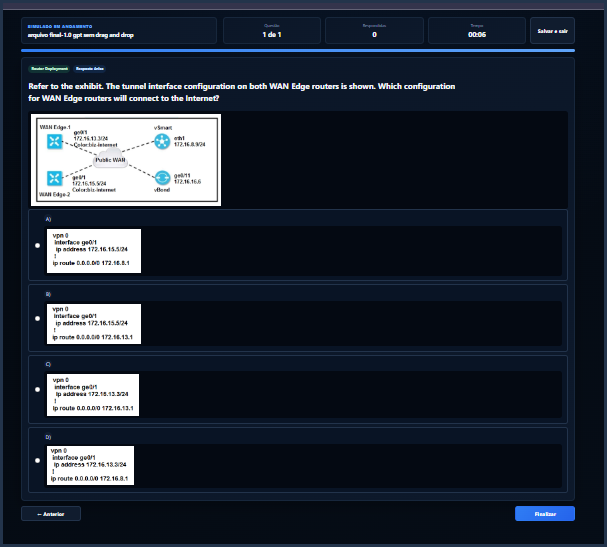
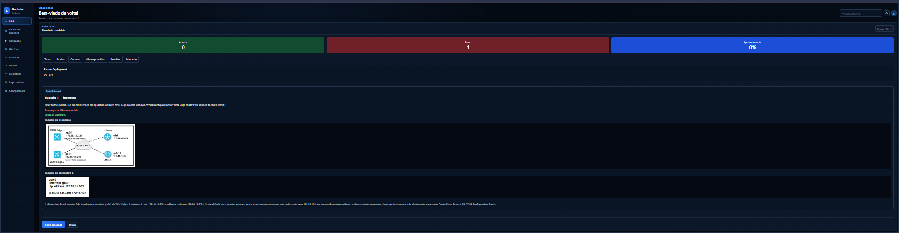

<p align="center">
  
</p>

<h1 align="center">🚀 Simulador Academy</h1>

<p align="center">
  Plataforma web para simulados, certificações, revisão de questões e acompanhamento de desempenho.
</p>

<p align="center">
  
  
  
  
  
</p>

---

## 📑 Índice

- [✨ Visão geral](#-visão-geral)
- [🖼️ Galeria](#️-galeria)
- [🏠 Dashboard principal](#-dashboard-principal)
- [⚙️ Configuração do simulado](#️-configuração-do-simulado)
- [📝 Execução em Focus Mode](#-execução-em-focus-mode)
- [📊 Resultado e revisão](#-resultado-e-revisão)
- [📚 Recursos](#-recursos)
- [📂 Estrutura do CSV](#-estrutura-do-csv)
- [🖼️ Organização das imagens](#️-organização-das-imagens)
- [🔄 Fluxo de utilização](#-fluxo-de-utilização)
- [💾 Backup e persistência](#-backup-e-persistência)
- [🚀 Publicação no GitHub Pages](#-publicação-no-github-pages)
- [🛠️ Tecnologias](#️-tecnologias)

---

## ✨ Visão geral

O **Simulador Academy** é uma aplicação web executada inteiramente no navegador. Ela foi criada para organizar bancos de questões, realizar simulados, salvar o progresso, revisar erros e acompanhar o desempenho ao longo do tempo.

> 🔒 Os bancos, respostas, progresso e histórico ficam armazenados localmente no navegador por meio do IndexedDB.

### Destaques

- 📚 Múltiplos bancos de questões
- 📥 Importação por CSV UTF-8
- 📦 Importação por pacote ZIP
- 🖼️ Imagens no enunciado e nas alternativas
- ✅ Questões de resposta única
- ☑️ Questões com múltiplas respostas
- 💾 Salvamento automático
- ▶️ Continuação do ponto exato onde parou
- 🎯 Focus Mode durante a prova
- 📊 Estatísticas gerais e por categoria
- 🔎 Revisão detalhada
- 📜 Histórico com botão **Ver detalhes**
- ⭐ Favoritos e questões marcadas
- 📤 Exportação e restauração de backup

---

## 🖼️ Galeria

<p align="center">
  
</p>

---

## 🏠 Dashboard principal

<p align="center">
  
</p>

O dashboard concentra as informações e ações mais importantes do sistema.

### Funções disponíveis

- 📈 Resumo de simulados realizados
- 🧮 Total de questões respondidas
- 🎯 Taxa média de acertos
- ⏱️ Tempo total de estudo
- ▶️ Continuação de simulados em andamento
- ⚡ Ações rápidas
- 📚 Biblioteca de bancos
- 📥 Importação de novos bancos
- 📜 Histórico recente
- 💾 Exportação de backup

---

## ⚙️ Configuração do simulado

<p align="center">
  
</p>

Antes de iniciar, o usuário pode configurar o teste de acordo com seu objetivo.

### Opções

- 🔢 Quantidade de questões
- ⏲️ Tempo limite em minutos
- 🔀 Embaralhamento das questões
- ⚠️ Aviso de questões não respondidas
- ▶️ Iniciar novo simulado
- 💾 Continuar um simulado salvo
- 🗑️ Apagar progresso existente

---

## 📝 Execução em Focus Mode

<p align="center">
  
</p>

Durante a prova, a interface entra em **Focus Mode**. Menus e elementos secundários são ocultados para reduzir distrações.

### Informações exibidas

- 📄 Banco em execução
- 🔢 Questão atual e total
- ✅ Quantidade respondida
- ⏱️ Cronômetro
- 📈 Barra de progresso
- 💾 Botão **Salvar e sair**
- ◀️ Botão **Anterior**
- ▶️ Botão **Próxima**
- 🖼️ Imagens em tamanho original
- 🔍 Ampliação da imagem ao clicar

---

## 📊 Resultado e revisão

<p align="center">
  
</p>

Ao finalizar o simulado, o sistema apresenta um resumo completo e permite revisar cada questão.

### Resumo

- 🟢 Acertos
- 🔴 Erros
- 🔵 Aproveitamento
- ⏱️ Tempo total
- 📊 Desempenho por categoria

### Filtros da revisão

| Filtro | Função |
|---|---|
| 📋 Todas | Exibe todas as questões |
| ❌ Erradas | Exibe apenas respostas incorretas |
| ✅ Corretas | Exibe apenas respostas corretas |
| ⏳ Não respondidas | Exibe questões em branco |
| ⭐ Favoritas | Exibe as questões favoritas |
| 🚩 Marcadas | Exibe questões marcadas para revisão |

### Cada questão revisada mostra

- 🏷️ Categoria
- 📝 Enunciado
- 👤 Resposta do usuário
- ✅ Resposta correta
- 💬 Feedback
- 🖼️ Imagem do enunciado
- 🖼️ Imagens das alternativas relevantes

---

## 📚 Recursos

### Banco de questões

- Importação de vários bancos
- Nome personalizado para cada banco
- Contagem de questões
- Histórico separado
- Exclusão do banco
- Persistência no navegador

### Questões

- `single`: uma resposta correta
- `multiple`: duas ou mais respostas corretas
- Texto no enunciado
- Imagem no enunciado
- Texto nas alternativas
- Imagem nas alternativas
- Feedback individual

### Histórico

Os novos resultados armazenam a revisão completa. O botão **Ver detalhes** reabre:

- erros e acertos;
- enunciados;
- respostas;
- feedbacks;
- imagens;
- estatísticas por categoria.

> ℹ️ Resultados antigos, criados antes do histórico detalhado, podem conter apenas percentual, acertos, total e data.

---

## 📂 Estrutura do CSV

Utilize o seguinte cabeçalho:

```csv
id;categoria;tipo;pergunta;imagem_pergunta;alt_a;img_a;alt_b;img_b;alt_c;img_c;alt_d;img_d;alt_e;img_e;correta;feedback
```

### Colunas

| Coluna | Descrição |
|---|---|
| `id` | Identificador único da questão |
| `categoria` | Assunto ou domínio |
| `tipo` | `single` ou `multiple` |
| `pergunta` | Enunciado |
| `imagem_pergunta` | Nome da imagem do enunciado |
| `alt_a` até `alt_e` | Textos das alternativas |
| `img_a` até `img_e` | Imagens das alternativas |
| `correta` | Resposta correta |
| `feedback` | Explicação da resposta |

### Exemplo de questão simples

```csv
1;Routing;single;Qual protocolo utiliza TCP 179?;;BGP;;OSPF;;RIP;;EIGRP;;;A;O BGP utiliza TCP 179.
```

### Exemplo de múltiplas respostas

```csv
2;Routing;multiple;Quais protocolos são IGP?;;OSPF;;BGP;;EIGRP;;MPLS;;;A,C;OSPF e EIGRP são protocolos IGP.
```

---

## 🖼️ Organização das imagens

Exemplo de pasta:

```text
imagens/
├── 01-pergunta.png
├── 01-A.png
├── 01-B.png
├── 01-C.png
├── 01-D.png
├── 02-pergunta.png
└── ...
```

No CSV:

```csv
imagem_pergunta;img_a;img_b;img_c;img_d
01-pergunta.png;01-A.png;01-B.png;01-C.png;01-D.png
```

As imagens são exibidas no tamanho original dentro de uma área com rolagem horizontal. Clique na imagem para abrir o zoom.

---

## 🔄 Fluxo de utilização

```text
📥 Importar CSV ou ZIP
          ↓
🖼️ Importar pasta de imagens
          ↓
📚 Criar banco de questões
          ↓
⚙️ Configurar o simulado
          ↓
▶️ Iniciar prova
          ↓
💾 Salvar e continuar, quando necessário
          ↓
🏁 Finalizar
          ↓
📊 Consultar resultado
          ↓
🔎 Revisar erros, acertos e feedbacks
          ↓
📜 Reabrir pelo histórico
```

---

## 💾 Backup e persistência

O sistema utiliza **IndexedDB** para armazenar:

- bancos importados;
- progresso;
- ordem embaralhada;
- respostas;
- cronômetro;
- favoritos;
- questões marcadas;
- histórico;
- detalhes das revisões.

O backup exportado pode ser restaurado em outro navegador ou computador.

> ⚠️ Apagar os dados do navegador pode remover o conteúdo local. Exporte backups regularmente.

---

## 🚀 Publicação no GitHub Pages

1. Crie um repositório no GitHub.
2. Envie os arquivos do projeto para a raiz.
3. Abra **Settings → Pages**.
4. Em **Source**, selecione **Deploy from a branch**.
5. Escolha:
   - Branch: `main`
   - Pasta: `/root`
6. Clique em **Save**.
7. Aguarde a publicação.

Após atualizar arquivos do projeto, pressione:

```text
Ctrl + Shift + R
```

Isso força o navegador a buscar a versão mais recente.

---

## 🛠️ Tecnologias

| Tecnologia | Utilização |
|---|---|
| HTML5 | Estrutura da interface |
| CSS3 | Estilização responsiva e tema escuro |
| JavaScript ES6 | Regras, navegação e correção |
| IndexedDB | Bancos, progresso e histórico |
| PapaParse | Leitura de CSV |
| JSZip | Importação de pacotes ZIP |
| Service Worker | Cache e funcionamento como PWA |
| GitHub Pages | Hospedagem gratuita |

---

## 📁 Estrutura deste pacote de documentação

```text
README.md
docs/
├── banner.png
├── galeria.png
└── screenshots/
    ├── dashboard.png
    ├── configuracao.png
    ├── simulado.png
    └── resultado.png
```

Copie o `README.md` e a pasta `docs` para a raiz do seu repositório.

---

<p align="center">
  Desenvolvido para estudos, revisão e preparação para certificações.
</p>


## Correção V7.2.2

- Botão **Procurar novamente** agora executa a busca e mostra o resultado.
- Exibe mensagem quando nenhum progresso é encontrado.
- Exibe quantidade de progressos encontrados.
- Botão de recuperação mostra estado de carregamento e erros.
